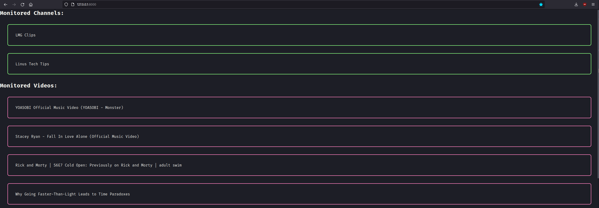
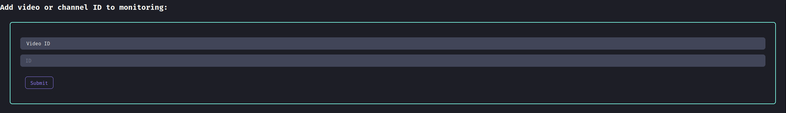
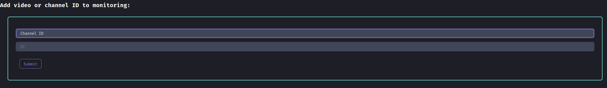
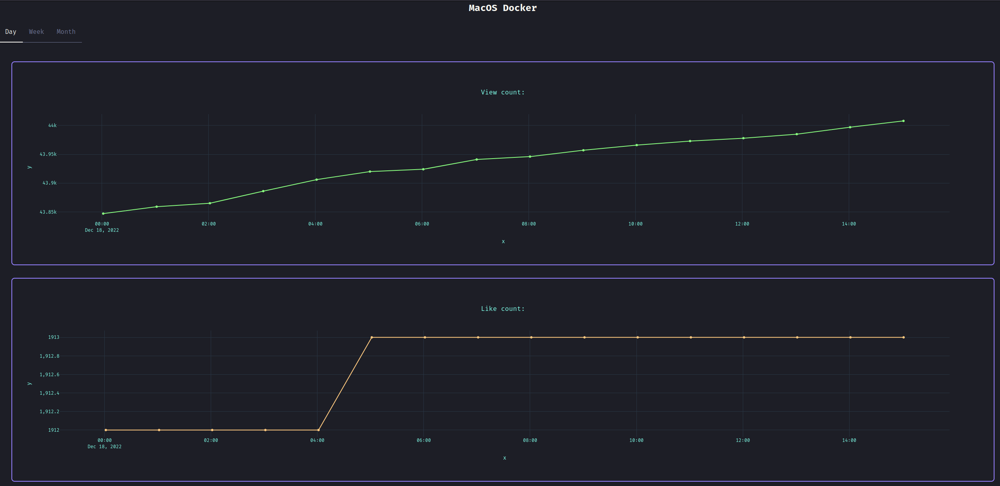
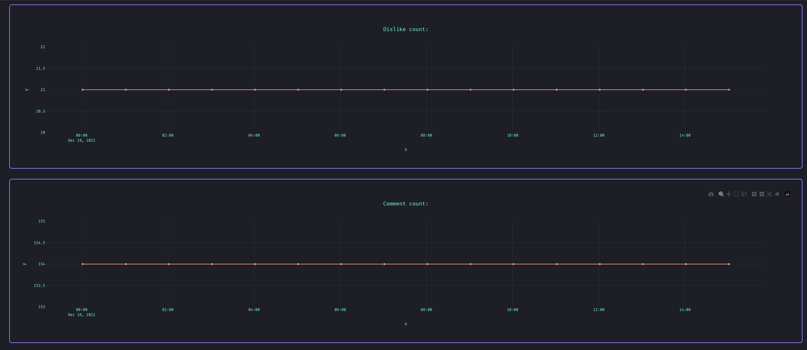
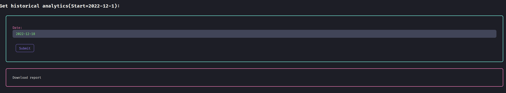
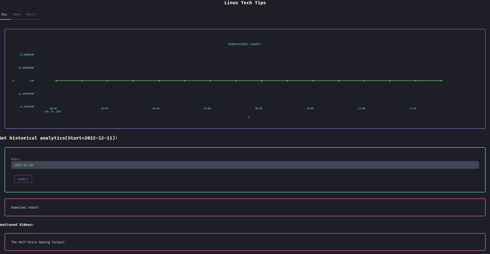
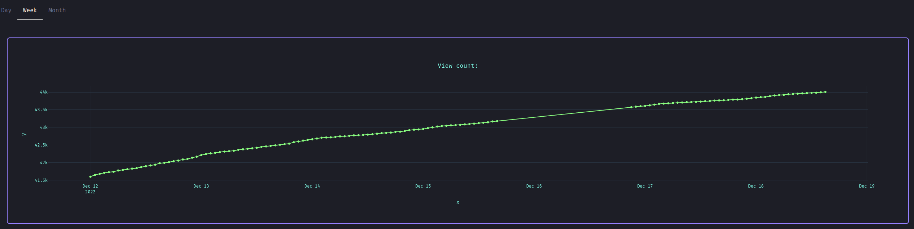
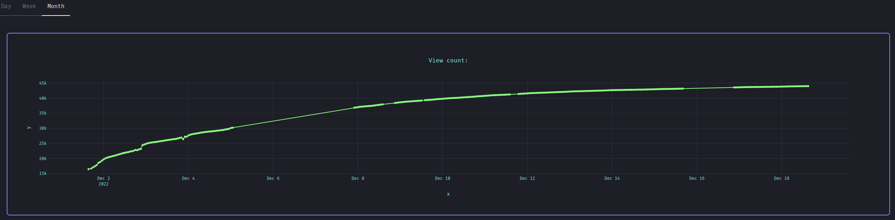
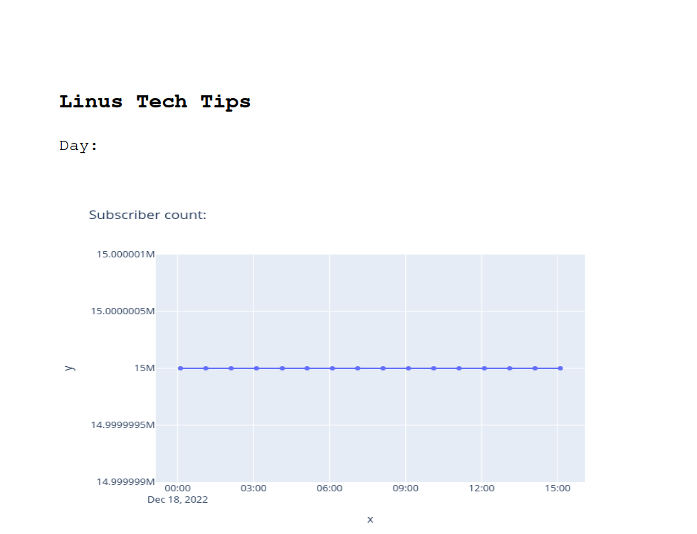

# ychanels_analitics

YouTube Channel & Video Statistics Report Generator

> [!WARNING]  
> This project is abandoned.

## Features

- Channel monitoring, based on Channel ID
- Video monitoring, based on Video ID
- Statistics:
    - Subscriber count
    - View count
    - Like count
    - Dislike count
    - Comment count
- Stats broken down by day, week and month
- Interactive plots
- Dracula UI
- PDF report

## Preview

### Home page:
</img>
</img>
</img>

### Video stats page:
</img>
</img>
</img>

### Channel stats page:
</img>

### Weekly stats:
</img>

### Monthly stats:
</img>

### PDF report example:
</img>

## Architecture

- Frontend:
    - Dracula UI
    - Plotly
- Backend:
    - Django
    - APScheduler
    - Pandas

## Run

> [!CAUTION]
> This project requires access to a [Piped](https://docs.piped.video/) API server. When the project was created in 2022, numerous publicly available API instances were operational. As of now, you must [self‑host](https://docs.piped.video/docs/self-hosting/) your own instance of Piped and configure its URL in the project. Without a working Piped instance, the tool will not function.

To get the project up and running locally, follow these steps:

1. Clone the repository and navigate into the project folder:
   ```bash
   git clone <repo-url>
   cd ychanels_analitics
   ```

2. Create and activate a virtual environment:
   ```bash
   python -m venv venv
   source venv/bin/activate
   ```

3. Install the Python dependencies:
   ```bash
   pip install -r requirements.txt
   ```

4. Configure the Piped API URL:
   Open `./ychanels_analitics/management/commands/scheduler_job.py` and replace the placeholder with the URL of your self‑hosted Piped instance:
   ```python
   class SchedulerJob():
       piped_API_domains = ["https://your-piped-instance.test"]
   ```

5. Apply database migrations:
   ```bash
   python manage.py migrate
   ```

6. Start Django server:
   ```bash
   python manage.py runserver
   ```

7. Launch the stats collection job:
   ```bash
   python manage.py scheduler
   ```

## License

This project is licensed under [MIT](LICENSE) License.
